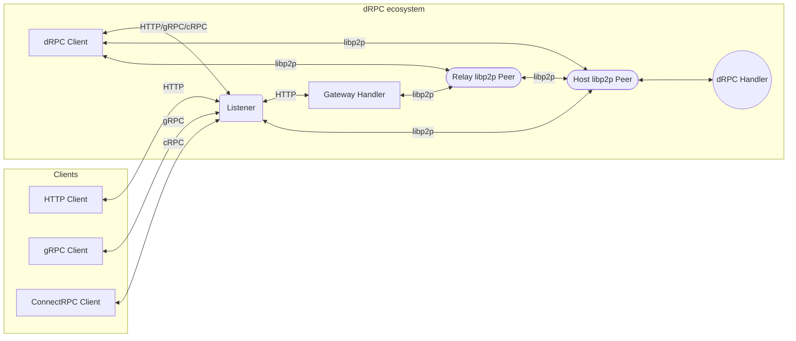
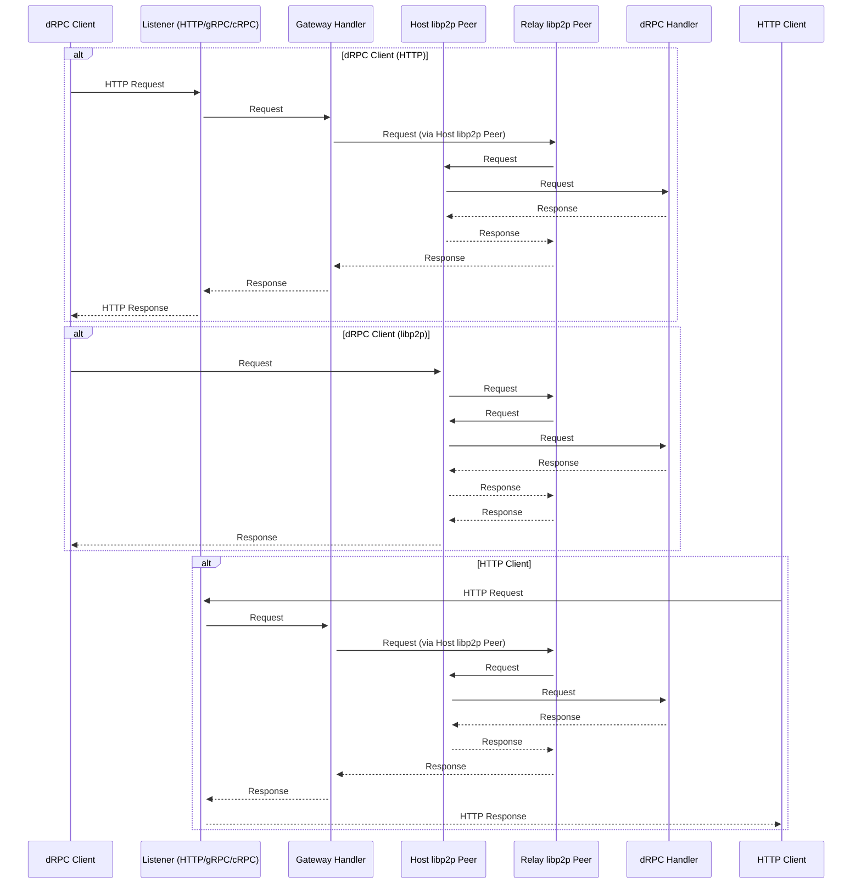

# Gateway Diagrams

## Flow Chart

## Communication paths for dRPC client
Here are the possible communication paths from "dRPC Client" to "dRPC Handler":

1. dRPC Client -> Listener -> Gateway Handler -> Host libp2p Peer -> dRPC Handler
2. dRPC Client -> Listener -> Gateway Handler -> Relay libp2p Peer -> Host libp2p Peer -> dRPC Handler
3. dRPC Client -> Host libp2p Peer -> dRPC Handler
4. dRPC Client -> Relay libp2p Peer -> Host libp2p Peer -> dRPC Handler

## Sequence Diagram

## Description

The diagrams above illustrate the request flow in dRPC. There are multiple entry points for clients:

1.  **dRPC Client:** This client is specifically designed to work with the dRPC library. It can connect via:

    - **HTTP, gRPC, or ConnectRPC:** The dRPC client can send requests to the Listener using any of these protocols.
    - **libp2p Multiaddresses:** The dRPC client can directly connect to the libp2p network using the provided multiaddress.

2.  **Generic Clients:**
    - **HTTP Client:** Represents any standard HTTP client (like cURL) that can make requests to the dRPC gateway.
    - **gRPC Client:** A client using the gRPC protocol.
    - **ConnectRPC Client:** A client using the ConnectRPC protocol.

**Gateway and Relay:**

The Gateway Handler forwards requests to the dRPC Handler via a Relay libp2p Peer, which helps in routing requests through the libp2p network.

**Transport Prioritization:**

When the dRPC client uses libp2p, it prioritizes transports in the following order:

1.  WebTransport/Quick
2.  WebRTC
3.  TCP/WS

## Comparison Table

| Feature                         | dRPC                                 | ConnectRPC                         | gRPC                          |
| ------------------------------- | ------------------------------------ | ---------------------------------- | ----------------------------- |
| Transport                       | libp2p, HTTP (with streaming)        | HTTP/1.1, HTTP/2                   | HTTP/2                        |
| Protocol                        | ConnectRPC, Custom                   | ConnectRPC, gRPC                   | gRPC                          |
| Network                         | Peer-to-peer (libp2p), Client-Server | Client-Server                      | Client-Server                 |
| Streaming                       | Client, Server, Bidirectional        | Client, Server, Bidirectional      | Client, Server, Bidirectional |
| Gateway                         | Built-in (libp2p forwarding)         | Separate gateway required          | Separate gateway required     |
| Address Format                  | Multiaddr (libp2p), HTTP URL         | HTTP URL                           | HTTP URL                      |
| Client-side Streaming over HTTP | Yes (WebTransport, WebRTC, WS)       | Yes (using WebSockets for Connect) | No (Requires HTTP/2)          |
